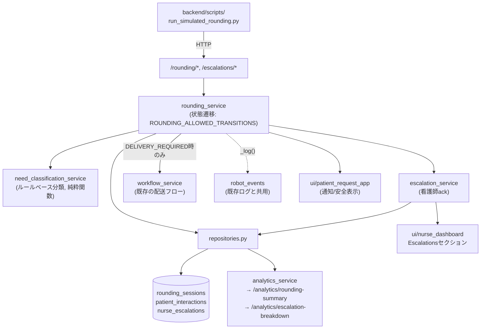
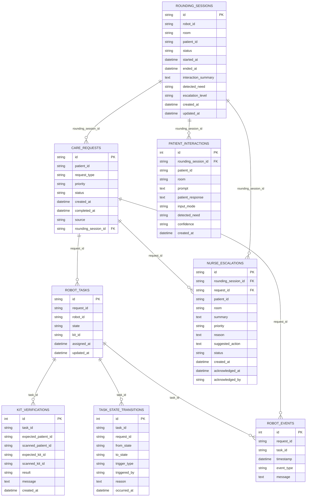

# アーキテクチャ・データモデル

[README](../README.md)の続き。全体構成図・データモデル・ドメイン登録・マルチロボット対応・UIのリアルタイム更新の詳細。

- [巡回ワークフローのアーキテクチャ](#巡回見守りワークフローのアーキテクチャ)
- [データモデル](#データモデル)
- [ドメイン登録テーブル](#ドメイン登録テーブルhospitalwardroombedpatientnurserobot)
- [マルチロボット対応](#マルチロボット対応)
- [UIのリアルタイム更新](#uiのリアルタイム更新)

---

## 巡回・見守りワークフローのアーキテクチャ

`rounding_service`の状態遷移ルール（`ROUNDING_ALLOWED_TRANSITIONS`）は、既存の配送フロー用`ALLOWED_TRANSITIONS`とは意図的に別辞書として`robot_service.py`に定義されている。両者を1つの辞書にまとめると、片方のワークフロー変更がもう片方の安全ゲート（`VERIFYING_PATIENT`→`DOCKING`のQR照合限定・`KIT_RELEASED`の看護師確認限定など）に気づかないまま影響してしまうリスクがあるため。2つのワークフローが交わるのは、巡回中に「配送が必要」と分類された（`DELIVERY_REQUIRED`）ときの1点だけで、そこから先は既存の配送フローがそのまま引き継ぐ。

---

## データモデル

`backend/db/models.py`で定義される8テーブル。タイムスタンプ列は全て`DateTime`型。`request_id`/`task_id`はSQLAlchemyレベルの`ForeignKey`制約として実際に強制されており、`robot_tasks`には「ロボット単位で非終端状態のタスクは同時に1件まで」という安全制約を守るための部分ユニークインデックス（`UNIQUE(robot_id) WHERE state NOT IN ('IDLE','COMPLETED','ERROR')`）も張られている。

| テーブル | 役割 |
|---|---|
| `care_requests` | 患者リクエスト自体（何を・誰が・いつ）。ロボットワークフローの状態は持たない。`source`（`patient_tablet`/`robot_rounding`/`nurse_manual`/`demo_seed`）と`rounding_session_id`（nullable）で、リクエストが患者タブレット由来か巡回セッション由来かを区別する |
| `robot_tasks` | リクエストに対する実際のロボット実行（1タスク=1行、`state`が`robot_service.py`のステートマシン値）。ロボット単位で非終端状態のタスクは同時に1件までという同時実行制約がある |
| `kit_verifications` | QR照合の**試行**ごとの1行（OK/NG問わず）。`expected_*`と`scanned_*`を分けることで、患者違いなのかキット違いなのかを判別できる |
| `task_state_transitions` | `robot_tasks.state`が変化するたびの構造化された履歴。`trigger_type`/`triggered_by`を使って集計しやすくした分析用の記録（`/analytics/state-durations`が利用） |
| `robot_events` | 看護師ダッシュボードのログ表示に使う、人間可読なイベントログ。巡回ワークフローのイベントもここに記録され、既存のログ表示と統合される |
| `rounding_sessions` | ロボットが病棟内を1回巡回する単位。`status`は`ROUNDING_ALLOWED_TRANSITIONS`（配送用とは別辞書）の値を持つ |
| `patient_interactions` | 巡回セッション内の声掛け・応答1回ごとの記録。`detected_need`/`confidence`は要望分類の結果 |
| `nurse_escalations` | 看護師へ通知すべき内容のキュー。`request_id`はnullable（配送を伴わない純粋な通知もある） |

---

## ドメイン登録テーブル（Hospital/Ward/Room/Bed/Patient/Nurse/Robot）

`backend/core/config.py`の`PATIENTS`辞書（患者2名分をハードコード）に加えて、`hospitals` / `wards` / `rooms` / `beds` / `patients` / `nurses` / `robots`の7テーブルを追加し、病院組織構造を実データとして持てるようにした。既存の`care_requests`/`robot_tasks`/`rounding_sessions`などが使う`patient_id`/`robot_id`/`room`は引き続きプレーンな文字列のままで、このテーブル群へのFK化はしていない（安全制約に関わる配送・巡回フローのテスト全体に影響する変更のため、意図的に別PRへ切り出す）。`backend/services/domain_service.py`の`seed_default_domain_data()`が、既存の`PATIENTS`辞書と`workflow_service.DEFAULT_ROBOT_ID`と同じ内容（病院1・病棟1・患者2名分の部屋とベッド・看護師1名・ロボット1台）を投入し、`python -m backend.scripts.seed_domain_data`で明示的に実行できる。読み取り専用の`GET /patients`・`GET /patients/{id}`・`GET /robots`・`GET /wards`（病棟→部屋→ベッド→入居患者のネスト構造）で参照できる。

---

## マルチロボット対応

`robot_tasks`には「ロボット単位（`robot_id`）で非終端状態のタスクは同時に1件まで」という部分ユニークインデックス（`ux_robot_tasks_active_robot`）が張られており、データモデルとしては複数ロボットに以前から対応していた。ただし配送フロー側の`workflow_service.py`はその上で常に`DEFAULT_ROBOT_ID`（`"ROBOT_1"`）1台にしか実際には割り当てておらず、そのギャップをサービス層で解消した。

- `workflow_service.create_request()` / `get_current_state()`が任意の`robot_id`引数を取るようになった（未指定時は従来どおり`DEFAULT_ROBOT_ID`、既存呼び出し元の挙動は変わらない）
- `_view()`が返す辞書に`robot_id`が追加され、`GET /requests` / `GET /requests/{id}` / `GET /state`のレスポンス、および看護師ダッシュボードのタスク表示行から、どのロボットのタスクかが分かるようになった
- `POST /requests`が`robot_id`を任意項目として受け付ける
- `rounding_service.require_delivery()`が、巡回セッション自身の`robot_id`（`start_rounding()`で指定されたロボット）を配送タスクへそのまま引き継ぐようになった
- `domain_service.list_robots_view()`が、登録済みの各ロボットに`repositories.get_active_task_for_robot()`由来のライブな`status`（`IDLE`/`BUSY`）を付与して返す。`domain_service.pick_available_robot_id()`（空いているロボットのidを1台返す、全て稼働中なら`None`）の土台にもなっている

---

## UIのリアルタイム更新

患者用タブレットUI・看護師ダッシュボードは、どちらも従来`time.sleep(3); st.rerun()`でスクリプト全体をブロックしてから丸ごと再実行・再描画する自前ポーリングだった。これを`st.experimental_fragment(run_every=2)`に置き換え、各セクション（看護師ダッシュボードのEscalations/タスク一覧/ログ、患者UIの画面全体）がそれぞれ独立したタイマーで自動的に部分再描画されるようにした。

- 看護師ダッシュボードの自動更新は常時ON（チェックボックス不要）
- 患者UIは「選択画面」「待機画面」「完了/エラー画面」の3状態すべてを1つのフラグメントが毎回組み立て直すため、看護師によるリセットや巡回からのエスカレーションなど、ボタン操作以外の理由で状態が変わった場合でも自動的に追従する
- 新規の外部依存は追加していない（`streamlit==1.35.0`に元々含まれる機能）。体感としては「短間隔ポーリング」のままであり、サーバー側からの即時プッシュ通知（真のWebSocket/SSE）ではない
